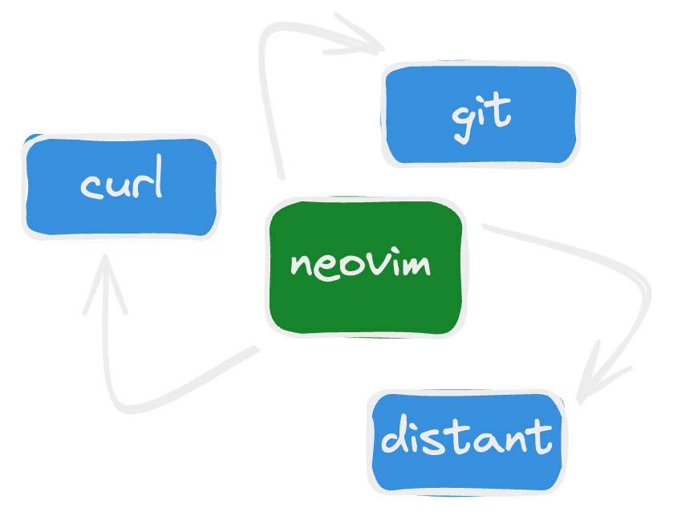
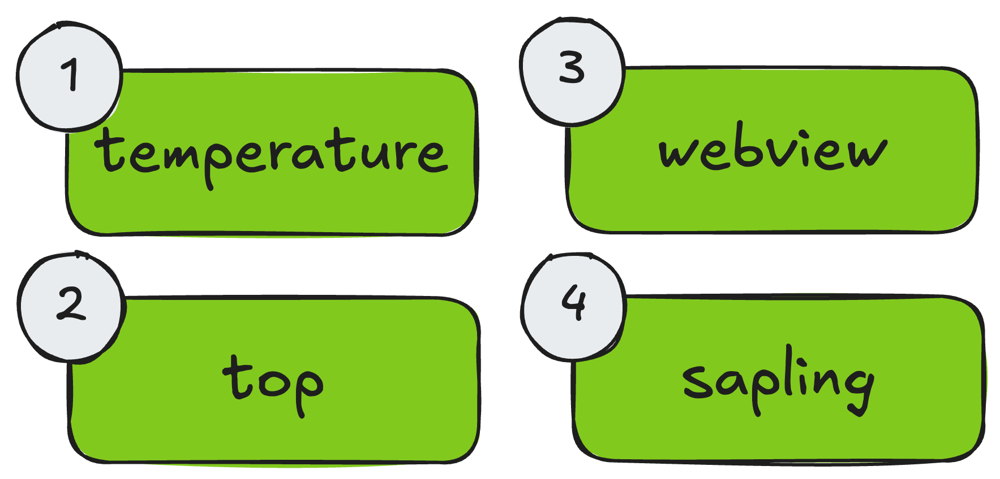
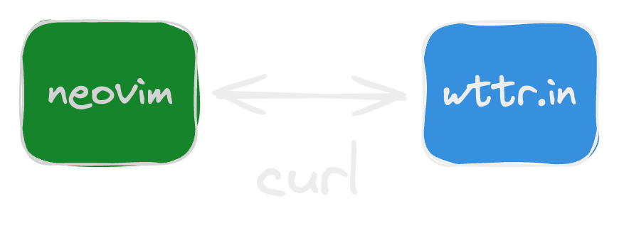
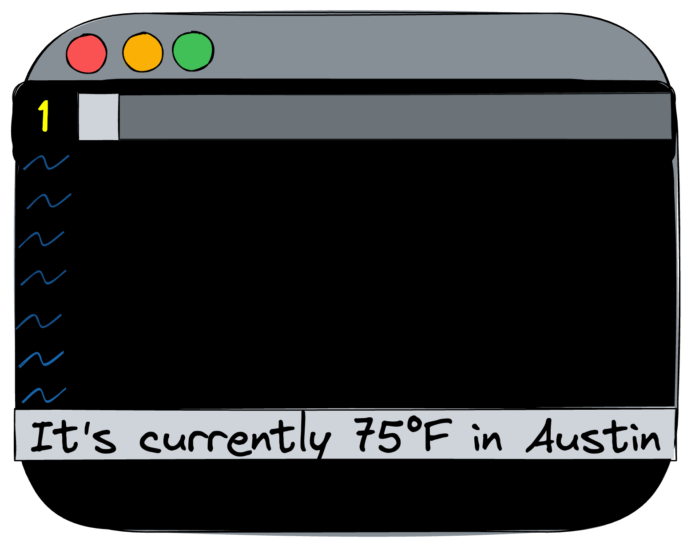
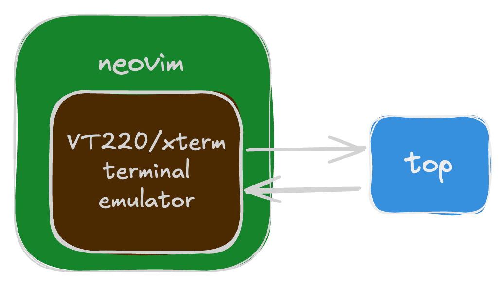
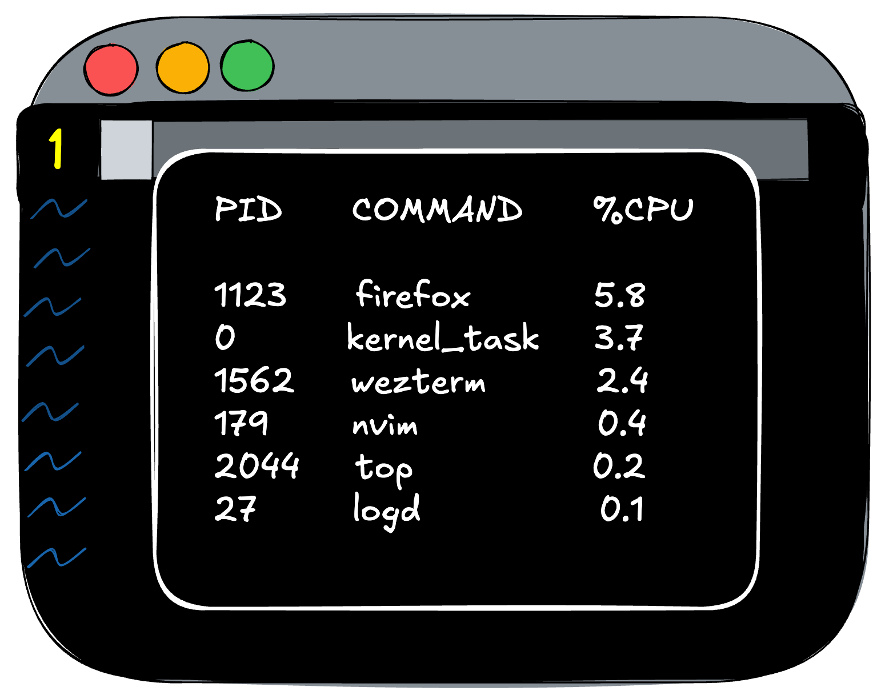
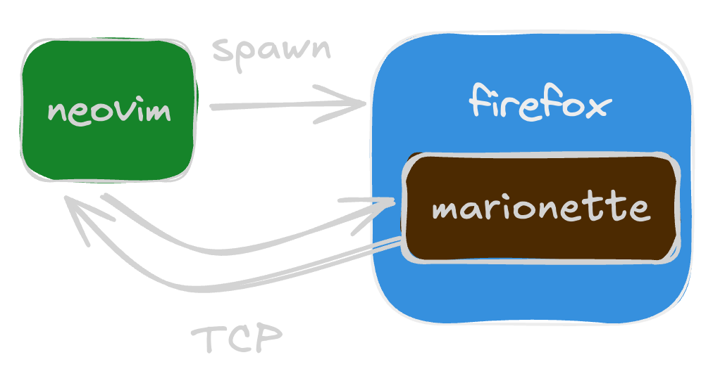
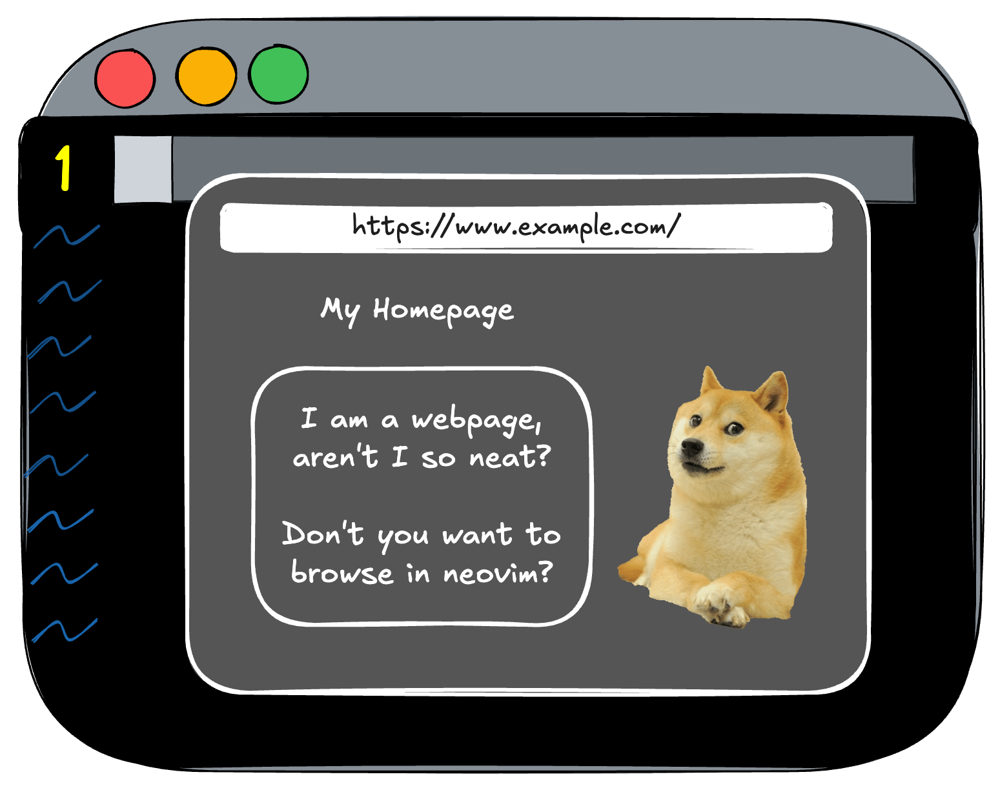
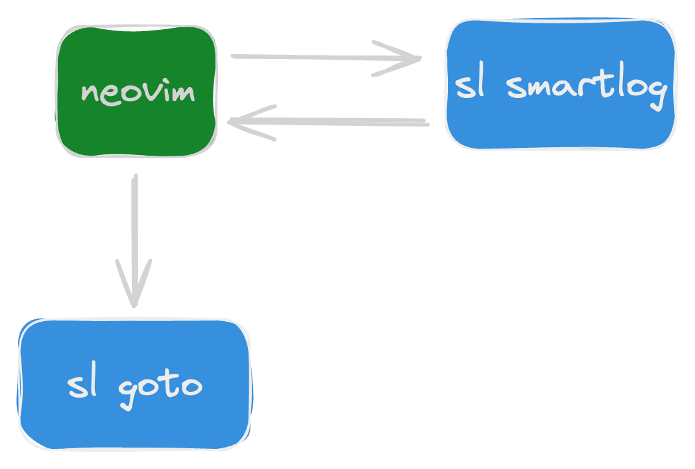
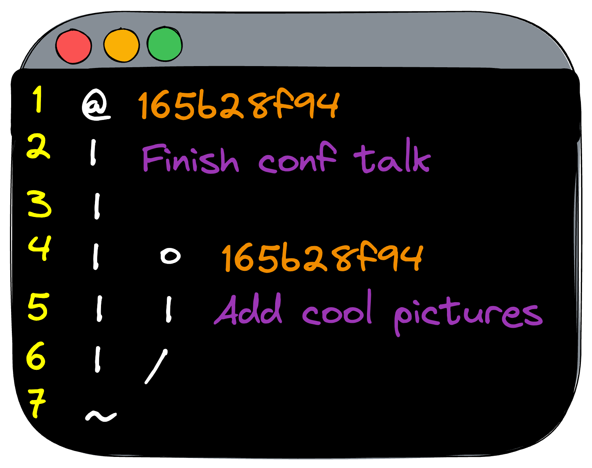

What are we talking about?
---

<!-- column_layout: [1, 1] -->

<!-- column: 0 -->



<!-- pause -->

<!-- column: 1 -->



<!-- reset_layout -->

<!-- end_slide -->

What is a command-line interface?
---

> A means to interact with a computer program by inputting lines of text called _command-lines_.
>
> Source: [](https://en.wikipedia.org/wiki/Command-line_interface)

<!-- pause -->

### Kinds of CLIs

<!-- pause -->
1. Command-oriented: do one thing with each execution.
    1. `curl` transfers data using network protocols like HTTP
    2. `git` can retrieve & manipulate git repositories
    3. `docker` exposes commands to run and manage containers
<!-- new_line -->
<!-- pause -->
2. Stream-oriented: do many things over standard or network I/O.
    1. `rust-analyzer` accepts requests and responds via JSON over stdin/stdout
    2. `firefox` can be remote controlled via marionette over TCP
    3. `rg` supports outputting results to stdout as a stream of lines of JSON
<!-- new_line -->
<!-- pause -->
3. Interactive: do many things with a user interface & keyboard input.
    1. `top` displays an ever-changing list of processes
    2. `bash` continuously accepts commands and execute them
    3. `lazygit` provides a terminal user interface (TUI) to do git operations

<!-- end_slide -->

<!-- jump_to_middle -->


<!-- end_slide -->

Piping commands into neovim 
---

### Run program connected to a pipe

Running `:!` will execute the command piped (not in a terminal), and output into
a specialized space within neovim. Supplying curl with `-s` will suppress curl's
output of retrieving the response.

We'll specifically use `?T` to force ANSI character response since we cannot
handle color codes in the output.

```vim
:! curl -s "https://wttr.in/?T"
```

<!-- pause -->

### Run program connected to a pipe and place in buffer

Running `:%!` will behave just like `:!`, but place the output into the current
buffer.

```vim
:%! curl -s "https://wttr.in/?T"
```

<!-- end_slide -->

<!-- jump_to_middle -->


<!-- end_slide -->

How to invoke CLIs from neovim (old way)
---

Up to neovim 0.9, we needed a variety of different APIs to invoke external
processes in neovim:

| Method                  | Description                                       | Async?  |
| ----------------------- | ------------------------------------------------- | ------- |
| `:! {cmd}`              | Run {cmd} in shell connected to a pipe            | No      |
| `:%! {cmd}`             | Same as `:!`, but inserts output into buffer      | No      |
| `:terminal {cmd}`       | Run {cmd} in non-interactive shell connected pty  | **Yes** |
| `:call system({cmd})`   | Run {cmd} and get output as a string              | No      |
| `:call termopen({cmd})` | Run {cmd} in pseudo-terminal in current buffer    | **Yes** |
| `io.popen()`            | Executes shell command (part of Lua stdlib)       | **Yes** |
| `uv.spawn()`            | Asynchronously process spawn (part of luv)        | **Yes** |
| `fn.system({cmd})`      | Same as vim command `system({cmd})`               | No      |
| `fn.termopen({cmd})`    | Spawns {cmd} in a new pseudo-terminal session     | **Yes** |
| `api.nvim_open_term()`  | Creates a new terminal without a process          | **Yes** |

<!-- end_slide -->

How to invoke CLIs from neovim (new way)
---

With the introduction of `vim.system()` in neovim 0.10, the act of executing
processes synchronously or asynchronously is streamlined! So now we care about:

| Method                  | Description                                     | Async?    |
| ----------------------- | ----------------------------------------------- | --------- |
| `vim.system()`          | Run {cmd} synchronously or asynchronously       | **Both**  |
| `fn.termopen({cmd})`    | Spawns {cmd} in a new pseudo-terminal session   | **Yes**   |
| `api.nvim_open_term()`  | Creates a new terminal without a process        | **Yes**   |

<!-- pause -->

We're just going to focus on the first two. Rarely do you want to use
`nvim_open_term()` unless you are proxying a process. A particular use case is
`distant.nvim` proxying your remote shell as if it was open in neovim.

<!-- pause -->

### How to use vim.system()

```lua
-- Runs asynchronously:
vim.system({'echo', 'hello'}, { text = true }, function(obj) 
    print(obj.code) 
    print(obj.stdout) 
    print(obj.stderr) 
end)
```

```lua
-- Runs synchronously:
local obj = vim.system({'echo', 'hello'}, { text = true }):wait()
-- { code = 0, signal = 0, stdout = 'hello', stderr = '' }
```

<!-- end_slide -->

<!-- jump_to_middle -->


<!-- end_slide -->

Writing a wrapper for temperature
---

<!-- column_layout: [1, 1] -->

<!-- column: 0 -->

In this example, temperature information for a city is pulled from
`https://wttr.in` using `curl`. The website `wttr.in` supports a variety of
methods to output the temperature, and we'll make use of `?format=j1` to return
JSON.



So, to summarize, we'll be using:

1. `vim.system()` to execute `curl`
2. `vim.json.decode()` to parse curl's response

<!-- pause -->

<!-- column: 1 -->



<!-- reset_layout -->

<!-- end_slide -->

Temperature: checking the tools
---

What do we want it to do?

1. Check that `curl` exists
2. Ensure that `curl` is a version we expect
3. Verify that `https://wttr.in` (used to get temperature) is accessible

<!-- pause -->

Neovim provides a simplistic framework to validate conditions for a
plugin, and we can use this to both ensure that a CLI program is
installed and is the right version.

A standard practice is to include a `health.lua` file at the root of your
plugin that returns a check function, which you can invoke via `:checkhealth
MY_PLUGIN`.

```lua
local M = {}

M.check = function()
    vim.health.start("foo report")
    if check_setup() then
         vim.health.ok("Setup is correct")
    else
         vim.health.error("Setup is incorrect")
    end
end

return M
```

<!-- end_slide -->

Temperature: looking at health.lua
---

### Does curl exist?

```lua
if vim.fn.executable("curl") == 0 then 
    vim.health.error("curl not found")
end
```

<!-- pause -->

### Is curl the right version?

```lua
local results = vim.system({ "curl", "--version" }):wait()
local version = vim.version.parse(results.stdout)
if version.major ~= 8 then 
    vim.health.error("curl must be 8.x.x, but got " .. tostring(version))
end
```

<!-- pause -->

### Is https://wttr.in accessible?

```lua
local results = vim.system({ "curl", "wttr.in" }):wait()
if results.code ~= 0 then 
    vim.health.error("wttr.in is not accessible")
end
```

<!-- end_slide -->

<!-- jump_to_middle -->


<!-- end_slide -->

Writing a wrapper for top
---

<!-- column_layout: [1, 1] -->

<!-- column: 0 -->

In this example, we leverage `vim.fn.openterm()` to spawn `top` within a
terminal. To make things a little fancier, we'll abstract the logic into
a neovim command that creates a floating window and embeds `top` as the
running process within a terminal within the window.



So, to summarize, we'll be using:

1. `vim.fn.openterm()` to spawn `top` within a floating window

<!-- pause -->

<!-- column: 1 -->



<!-- reset_layout -->

<!-- end_slide -->

<!-- jump_to_middle -->


<!-- end_slide -->

Writing a wrapper for firefox
---

<!-- column_layout: [1, 1] -->

<!-- column: 0 -->

In this example, we spawn a headless instance of `firefox` - meaning no
graphical interface running on our desktop - and have it start with
**Marionette** enabled.

Firefox ships with the **Marionette** server enabled, which we'll use to
communicate using a **WebDriver** API over TCP to navigate to websites and
take screenshots that we can surface within neovim as images.



So, to summarize, we'll be using:

1. `vim.system()` to spawn **Firefox**
2. `vim.uv.new_tcp()` and associated to connect & communicate with **Marionette**
3. `vim.base64.decode()` to decode screenshot data from firefox to save as PNGs
4. `image.nvim` (neovim plugin) to display these screenshots within neovim

<!-- pause -->

<!-- column: 1 -->



<!-- reset_layout -->

<!-- end_slide -->

<!-- jump_to_middle -->


<!-- end_slide -->

Writing a wrapper for sapling
---

<!-- column_layout: [1, 1] -->

<!-- column: 0 -->

In this example, we will abstract leveraging `sl`, the Sapling CLI, to both
display current commits in a buffer and support switching between commits.



So, to summarize, we'll be using:

1. `vim.system()` to execute `sl` commands
    1. `sl smartlog` to show a series of commits
    2. `sl goto` to navigate to another commit
2. `vim.keymap.set()` to specify buffer-local bindings to interface with our
   *Sapling buffer*

<!-- pause -->

<!-- column: 1 -->



<!-- reset_layout -->

<!-- end_slide -->

<!-- jump_to_middle -->


<!-- end_slide -->

Credits
---

<!-- column_layout: [1, 1] -->

<!-- column: 0 -->

1. *Andrei Neculaesei* (3rd on Github) for both writing `image.nvim` and
   directly helping me diagnose issues with its use as a means to display
   browser screenshots with scrolling functionality in the `webview` example.

<!-- column: 1 -->


<!-- reset_layout -->

<!-- end_slide -->

Contact Info
---


